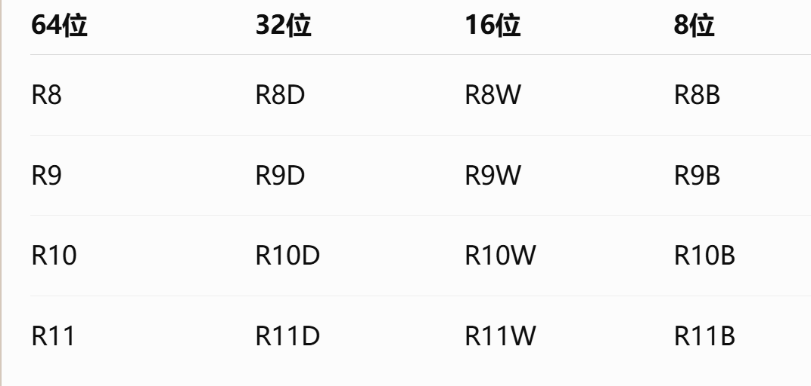
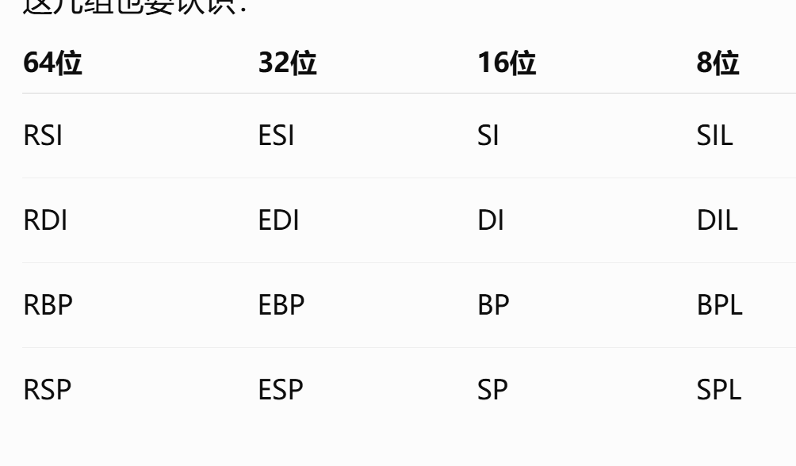

# mov 和 lea

mov 目标操作数，源操作数

把源放进目标

lea 目标，源

把源的地址放进目标

# 小端存储：X86-64使用。多字节数据，低位字节放在低地址，高位字节放在高地址

# 标志位：cpu做完一次运算会记录几个结果状态

1. ZF ：零标志位，zero flag
2. SF：Sign Flag符号标志，结果最高位是不是1
3. CF：Carry Flag仅为标志，无符号运算有没有进位
4. OF：Overflow flag，有符号运算有没有溢出
5. PF：Parity flag，奇偶标志。结果低8位中1的个数是不是偶数

# x86-64 是 64 位处理器，所以它支持 64 位形式的线性地址表示。物理不一定。x86一般是32位，也就是IA-32

# 处理器的基本运行环境：程序员能直接看到和使用的资源。

1. 通用寄存器：RAX等
2. 标志寄存器：保持运算状态
3. 内存：存放代码数据
4. 指令指针寄存器：RIP

运算器不是，是内部硬件但是不是程序员可以直接使用的。会写add之类的，但不会写”使用运算器“

# x86-64模式

1. 实模式。段地址：偏移地址。物理地址 = 短地址*16+偏移地址
2. 分段模式：地址通过寄存器和偏移地址共同决定。内存分为代码段、数据段、栈段等
3. 平展模式：常用

# 地址：

逻辑地址 → 线性地址 → 物理地址

最后一步一般由操作系统等完成。程序员不会控制

# 寄存器

RAX、RBX、RCX、RDX：64位
EAX、EBX、ECX、EDX：低32位
AX、BX、CX、DX：低16位
AL/AH、BL/BH、CL/CH、DL/DH：8位

扩展



无后缀：64位
D：32位
W：16位
B：8位

x86-64的8位寄存器



SI 是 16位
SIL 才是 8位

DI 是 16位
DIL 才是 8位

BP 是 16位
BPL 才是 8位

SP 是 16位
SPL 才是 8位


# 

| C 类型        |      字节数 | 汇编大小名        | GAS 伪指令   | 常用寄存器          |
| ----------- | -------: | ------------ | --------- | -------------- |
| `char`      |        1 | byte         | `.byte`   | `AL`           |
| `short`     |        2 | word         | `.word`   | `AX`           |
| `int`       |        4 | dword / long | `.long`   | `EAX`          |
| `long long` |        8 | qword / quad | `.quad`   | `RAX`          |
| `float`     |        4 | dword        | `.float`  | XMM寄存器         |
| `double`    |        8 | qword        | `.double` | XMM寄存器         |
| 指针          | 8，x86-64 | qword        | `.quad`   | `RAX` 等 64位寄存器 |

#

数组寻址
int 数组每个元素 4 字节
基址 + 下标 × 比例因子

例如int A[10]

```
A[0] 在 A首地址 + 0×4
A[1] 在 A首地址 + 1×4
A[2] 在 A首地址 + 2×4
```

# 表示范围

n 位无符号数范围：0 ~ 2^n - 1

n 位有符号补码范围：-2^(n-1) ~ 2^(n-1)-1

# 遇到加法，一般先转16进制算完再说

1. 看是几位运算，比如 8 位、16 位、32 位。

2. 先按二进制/十六进制做加法，得到完整结果。

3. 截断到当前位数，得到机器保存的结果。

4. CF：看完整结果有没有超过当前位数。

5. OF：看有符号角度有没有溢出。
   加法口诀：同号相加，结果变号，OF=1。

6. SF：看截断后结果最高位。

7. ZF：看截断后结果是否为 0。

8. PF：数截断后低 8 位中 1 的个数。