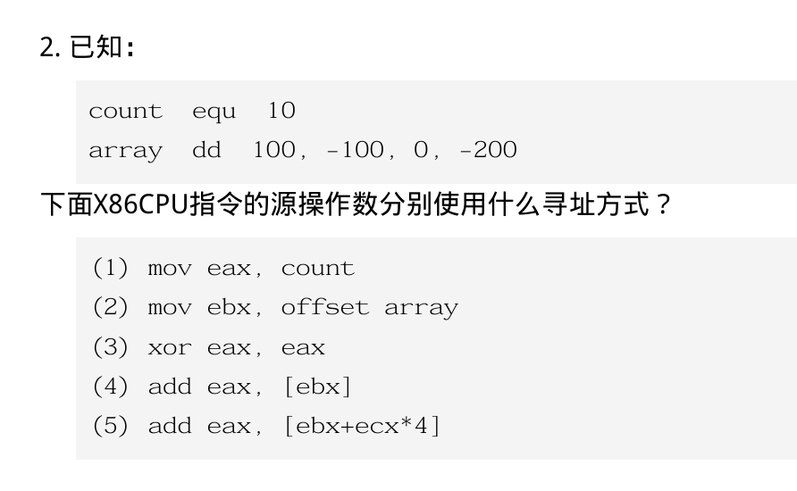

# 1. 

| 步骤         | 用什么完成                          | 产生什么文件                    |
| ---------- | ------------------------------ | ------------------------- |
| 1. 编辑源程序   | 文本编辑器 / 源程序编辑器                 | 汇编源文件，如 `.asm` 或 `.s`     |
| 2. 汇编      | 汇编程序，如 `MASM`、`as`             | 目标文件，如 `.obj` 或 `.o`      |
| 3. 连接      | 连接程序，如 `LINK`、`ld`             | 可执行文件，如 `.exe` 或无后缀可执行文件  |
| 4. 调试 / 运行 | 调试程序，如 `DEBUG`、`gdb`，或操作系统直接运行 | 一般不再产生新的主要文件，只是运行或调试可执行文件 |


# 

## 知识

指令：`指令  目的操作数, 源操作数`

| 类型  | 例子                    | 含义          |
| --- | --------------------- | ----------- |
| 立即数 | `10`                  | 数本身就在指令里    |
| 寄存器 | `rax`、`eax`、`rbx`     | 数据在寄存器里     |
| 内存  | `[rbx]`、`[rbx+rcx*4]` | 需要根据地址去内存里取 |


没有方括号：可能是立即数或寄存器
有方括号：通常就是访问内存

2. equ：常量定义，不是变量。类似c语言的宏
3. dd是数据定义：define double word：
   1. byte  = 8 位  = 1 字节
   2. word  = 16 位 = 2 字节
   3. dword = 32 位 = 4 字节
   4. qword = 64 位 = 8 字节
   5. `array dd 100, -100, 0, -200`表示内存中连续放4个32位整数。

```
array + 0   存 100
array + 4   存 -100
array + 8   存 0
array + 12  存 -200
```

4. 地址大小和数据大小不一样。地址一般都是64位。数据可能是32位甚至更少。
5. 方括号。没有方括号，直接用寄存器的值；有方括号，表示本身不是数据而是一个地址
6. RIP相对寻址
   1. 取全局变量或数组地址时
   2. rip是指令指针寄存器，保存当前指令附近地址
   3. [rip+array]表示通过当前地址+位移找到array。虽然这样写，但实际上会array会被汇编器转换成相对rip的位移量
7. 